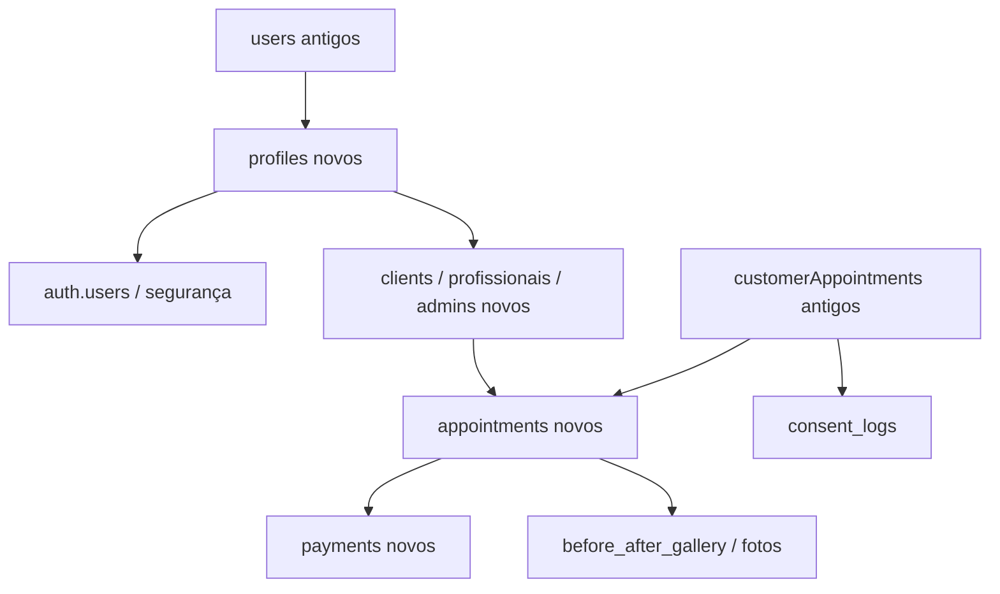

# Análise de Migração de Dados (Carol Sol)

Este documento apresenta uma análise estrutural e de compatibilidade completa entre o banco de dados do sistema antigo (`site-antigo.json`) e o modelo relacional do novo sistema (`novo-site.json`). 

O novo sistema é considerado a estrutura principal. Os dados existentes no novo sistema serão totalmente preservados, e a futura importação deverá ser idempotente, possuir modo *dry-run*, relatório de conflitos e suporte a *rollback* por lote.

---

## 1. Coleções e Tabelas Identificadas

Abaixo está o levantamento de todas as coleções/tabelas presentes em ambos os dumps, incluindo a contagem de registros em cada uma delas.

### 1.1. Sistema Antigo (`site-antigo.json`)
* **users**: 63 registros (usuários gerais, administradores, clientes).
* **customerAppointments**: 52 registros (agendamentos de clientes contendo dados de pagamento e questionários embutidos).
* **homeModules**: 10 registros (módulos da página inicial).
* **internalPages**: 5 registros (conteúdo de páginas estáticas e planos do clube capilar).
* **categories**: 3 registros (categorias de produtos/serviços).
* **products**: 2 registros (mega hairs/produtos do catálogo).
* **reviews**: 2 registros (avaliações de produtos).
* **coupons**: 1 registro (cupons de desconto).
* **shippingConfig**: 1 registro (configurações de frete).
* **orders**: 0 registros (tabela vazia).
* **orderItems**: 0 registros (tabela vazia).
* **addresses**: 0 registros (tabela vazia).
* **shippingRules**: 0 registros (tabela vazia).
* **customerSavedCards**: 0 registros (tabela vazia).

### 1.2. Sistema Novo (`novo-site.json`)
O sistema novo possui uma estrutura relacional avançada com tabelas divididas no Postgres (esquema public):
* **whatsapp_incoming_queue**: 85 registros (fila de mensagens do WhatsApp).
* **professional_availability**: 55 registros (janelas de atendimento das profissionais).
* **knowledge_articles**: 11 registros (base de conhecimento da IA).
* **ai_automation_flows**: 21 registros (fluxos de automação da IA).
* **audit_logs**: 7 registros (logs de auditoria).
* **plans**: 5 registros (planos de manutenção/assinatura do Clube Capilar).
* **services**: 4 registros (serviços cadastrados).
* **ai_service_settings**: 4 registros (parâmetros da IA para cada serviço).
* **profiles**: 3 registros (dados básicos de contas de usuários/admin/especialistas).
* **hair_methods**: 4 registros (técnicas de mega hair cadastradas).
* **hair_inventory**: 3 registros (lotes de estoque de cabelo).
* **chairs_or_rooms**: 2 registros (salas/cadeiras de atendimento).
* **admins**: 1 registro (vínculo de perfil admin e permissões).
* **clients**: 1 registro (dados do painel de cliente).
* **professionals**: 1 registro (perfil profissional/especialista).
* **coupons**: 1 registro (cupons ativos).
* **products**: 1 registro (produtos para venda).
* **consent_logs**: 1 registro (logs de aceitação de termos).
* **ai_settings**: 1 registro (configurações do chatbot).
* **salon_locations**: 1 registro (filiais físicas do salão).
* **marketing_promotions**: 1 registro (promoções vigentes).
* **business_settings**: 1 registro (metadados do negócio).
* *Tabelas sem registros cadastrados ainda:* `reviews`, `payments`, `waitlist`, `campaigns`, `referrals`, `commissions`, `appointments`, `ai_tool_calls`, `client_photos`, `product_sales`, `subscriptions`, `loyalty_points`, `ai_interactions`, `ai_request_logs`, `ai_plan_settings`, `blocked_schedule`, `payment_receipts`, `conversation_tags`, `technical_records`, `whatsapp_messages`, `ai_prompt_versions`, `professional_goals`, `before_after_gallery`, `human_handoff_tickets`, `whatsapp_message_logs`, `conversation_tag_links`, `payment_status_history`, `whatsapp_conversations`, `appointment_status_history`.

---

## 2. Análise de Compatibilidade de Campos

Abaixo está o mapeamento detalhado dos campos e tipos entre as estruturas antiga e nova para as principais entidades.

| Entidade Antiga | Campo Antigo | Entidade Nova | Campo Novo | Tipo / Compatibilidade |
| :--- | :--- | :--- | :--- | :--- |
| **users** | `id` (cuid) | **profiles** / **clients** | `id` (uuid) / `legacy_id` | **Incompatível (PK)**. CUID antigo não cabe em coluna UUID. É necessário gerar UUIDs novos e gravar o CUID em um campo de rastreabilidade. |
| **users** | `name` | **profiles** | `full_name` | Compatível (texto). |
| **users** | `email` | **profiles** (u.email) | `email` (auth.users) | Compatível (texto, único). |
| **users** | `role` | **profiles** | `role` | Compatível (`admin`, `professional`, `client`). |
| **users** | `cpf` | **profiles** / **clients** | `cpf` | Compatível (texto limpo). |
| **customerAppointments** | `id` (cuid) | **appointments** | `id` (uuid) / `legacy_id` | **Incompatível**. Requer geração de UUID e rastreio do ID legado. |
| **customerAppointments** | `status` | **appointments** | `status` | Compatível (com mapeamento de estados: `cancelled` -> `cancelled`, `scheduled` -> `confirmed`, etc.). |
| **customerAppointments** | `notes` | **appointments** | `notes` | Compatível (texto). |
| **customerAppointments** | `total_price` | **appointments** | `estimated_value` | Compatível (numérico). |
| **customerAppointments** | `duration_minutes` | **appointments** | `duration_minutes` | Compatível (inteiro). |
| **customerAppointments** | `before_image_url` | **before_after_gallery** | `before_photo_url` | Compatível (url de imagem). |
| **customerAppointments** | `after_image_url` | **before_after_gallery** | `after_photo_url` | Compatível (url de imagem). |
| **customerAppointments** | `questionnaire_data`| **appointments** | `intake_data` | Compatível (JSONB). |

---

## 3. Mapeamento de Relacionamentos e Fluxo de Migração

Para preservar a integridade referencial do novo sistema, a migração dos registros antigos deve respeitar a ordem lógica das dependências das chaves estrangeiras:



### 3.1. Usuários e Perfis (Profiles, Clients, Professionals, Admins)
1. **Perfis (Profiles)**: Para cada item da coleção `users` antiga, criaremos um registro em `public.profiles`. O `legacy_id` (CUID antigo) deve ser salvo em `profiles.instagram` ou em um campo dedicado/JSON de preferências para rastreabilidade.
2. **Autenticação (auth.users)**: Uma conta correspondente em `auth.users` deve ser criada via trigger do Supabase ou inserida diretamente com e-mail, telefone e senha temporária gerada de forma segura.
3. **Subperfis**:
   - Se `role === 'admin'`, criar registro em `public.admins` referenciando o `profile_id`.
   - Se `role === 'professional'`, criar registro em `public.professionals` referenciando o `profile_id`.
   - Se `role === 'client'` ou `role === 'user'`, criar registro em `public.clients` referenciando o `profile_id`.

> [!NOTE]
> **Resolução de Telefone/WhatsApp de Clientes**: A coleção antiga `users` **não possui** campo de telefone. O telefone deve ser extraído das ocorrências dos agendamentos em `customerAppointments.customer_phone` ou `questionnaire_data.phone` daquele usuário e inserido em `profiles.phone` e `clients.preferences->manual_contact`. Para usuários legados sem nenhum agendamento (25 usuários), o telefone será mantido como `null`.

### 3.2. Agendamentos (Appointments)
Os agendamentos antigos (`customerAppointments`) dependem de **Cliente**, **Profissional** e **Serviço**:
1. **Cliente (`client_id`)**: Resolvido encontrando o ID do cliente correspondente migrado no passo anterior (usando o `legacy_id` para cruzamento).
2. **Profissional (`professional_id`)**: Os agendamentos antigos **não possuem** identificador de profissional. Como o novo sistema exige um profissional responsável e só há uma especialista ativa cadastrada no novo dump (`a000e61c-64dd-448f-b52c-d18fd8a31a92` - Carolina Alves), todos os agendamentos antigos serão atribuídos a ela por padrão.
3. **Serviço (`service_id`)**: Resolvido através do arquivo `service-mapping.json`. Caso o serviço antigo não possua correspondente, ele será classificado como "Necessita Mapeamento Manual" (exemplo: Entrelace ou Ponto Americano).

### 3.3. Financeiro (Payments)
O sistema antigo não possui tabela de pagamentos. As transações financeiras estão embutidas no agendamento (`paid_amount`, `total_price`, `deposit_amount`, `payment_method`, `payment_status`).
* **Regra de Migração**: Para cada agendamento migrado que possua `paid_amount > 0` ou `payment_status === 'paid'`, deve ser criado um registro em `public.payments` referenciando o `client_id` e o `appointment_id`, preservando os valores, data de criação e método de pagamento correspondentes.

### 3.4. Questionários e Consentimentos (Consent Logs)
1. **Questionários**: O histórico de respostas do formulário da cliente (`questionnaire_data`) será migrado integralmente para a coluna `appointments.intake_data` (JSONB) no agendamento correspondente.
2. **Consentimentos (consent_logs)**: Os termos de consentimento aceitos pela cliente (armazenados em `questionnaire_data.acceptedTerms`) serão extraídos e salvos na tabela `public.consent_logs` vinculados ao `profile_id` da cliente, garantindo a conformidade com as políticas legais.

---

## 4. Riscos de Duplicidade e Conflitos

### 4.1. Conflito de E-mail (Unique Constraint em `profiles.email` / `auth.users.email`)
* **Risco**: Se um usuário do sistema antigo já estiver cadastrado manualmente no novo sistema com o mesmo e-mail, a tentativa de inserção falhará devido à restrição de chave única.
* **Solução recomendada**: O script de migração deve fazer um *lookup* por e-mail no sistema novo antes de inserir. Se o e-mail já existir, o script deve mesclar os registros associando o ID legado ao cadastro novo, sem duplicar a conta de autenticação.

### 4.2. Conflito de CPF (Unique Constraint em `profiles.cpf`)
* **Risco**: Usuários diferentes (com e-mails diferentes) usando o mesmo CPF ou CPFs antigos sem formatação adequada.
* **Solução recomendada**: Limpar todos os caracteres não numéricos do CPF e validar a unicidade. CPFs duplicados devem gerar um log no relatório de conflitos e suspender a inserção do registro secundário até revisão manual.

---

## 5. Mapeamento de Serviços (Resumo)

O novo sistema possui apenas 4 serviços cadastrados. O mapeamento completo das nomenclaturas antigas está definido em `service-mapping.json`.

* **Serviços Mapeados Automaticamente**:
  - `Avaliação` / `svc_evaluation` -> **Avaliação personalizada** (`52000000-0000-0000-0000-000000000004`)
  - `Fita Adesiva` / `invisible-hair` -> **Aplicação Fita Adesiva** (`52000000-0000-0000-0000-000000000001`)
  - `Manutenção` / `Manutenção futura` / `Remoção e aplicação` -> **Manutenção Fita Adesiva** (`52000000-0000-0000-0000-000000000003`)
* **Serviços que requerem Criação ou Mapeamento Manual**:
  - Ponto Americano Invisível (Alongamento e remoção)
  - Método Entrelace (Manutenção e aplicação)
  - Pacote de Tratamentos (Cronograma Capilar + Blindagem / Bio Proteína)
  - Serviços de Salão Gerais (Escova, Selante, Alinhamento)

---

## 6. Alterações de Banco Sugeridas no Novo Sistema

Para garantir a rastreabilidade da migração e a prevenção de duplicidades sem alterar a lógica core do novo sistema, sugerimos a aplicação das seguintes alterações no banco de dados de destino:

```sql
-- 1. Adição de coluna para tracking de ID de origem nas tabelas principais
alter table public.profiles add column if not exists legacy_id text unique;
alter table public.appointments add column if not exists legacy_id text unique;
alter table public.products add column if not exists legacy_id text unique;
alter table public.coupons add column if not exists legacy_id text unique;

-- 2. Criação de índices para otimização de buscas durante a migração
create index if not exists idx_profiles_legacy_id on public.profiles(legacy_id);
create index if not exists idx_appointments_legacy_id on public.appointments(legacy_id);
```

---

## 7. Próximos Passos e Bloqueios

### 7.1. Dúvidas a esclarecer com o Usuário
1. **Clientes sem telefone (25 registros)**: Devemos criar essas contas sem telefone (mantendo null) ou deseja que solicitemos o telefone no primeiro acesso?
2. **Métodos Capilares adicionais**: Deseja que o script crie automaticamente no novo banco as categorias de método que não existem (ex: Entrelace, Ponto Americano) ou prefere cadastrar manualmente antes de rodar o import?
3. **Administradores antigos**: O sistema antigo possui múltiplos administradores. Devemos migrar todos com acesso restrito ou mantê-los suspensos até liberação da Carolina Alves?

---
*Análise concluída. O script de importação não foi gerado e nenhuma alteração foi realizada no banco de dados de produção.*
